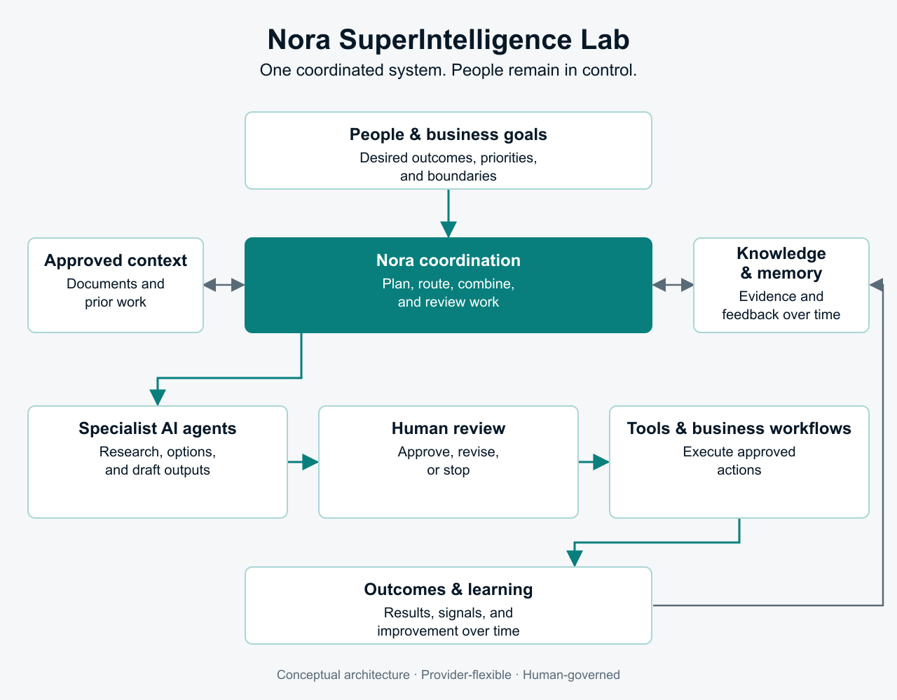
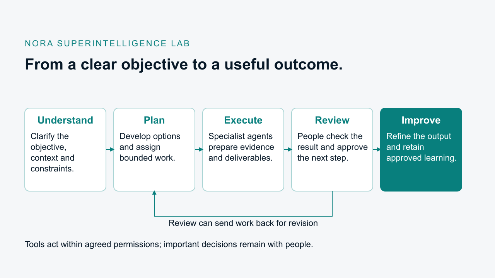
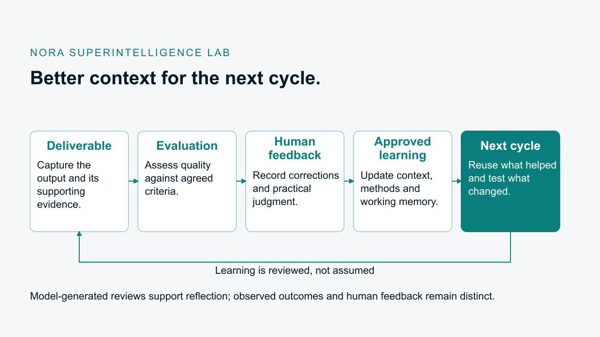

# Nora SuperIntelligence Lab

## From strategy to coordinated action

**AI-native orchestration · Human-led decisions · Durable workflows · Continuous learning**

Nora SuperIntelligence Lab explores how to carry a business objective through context, planning, bounded execution, human review, evidence, and learning.

Nora connects people, institutional knowledge, AI agents, and operational tools in a modular system. The goal is practical: help organizations improve decisions, accelerate execution, scale expertise, deliver measurable client value, and turn successful work into a repeatable advantage.

> **Current stage:** This repository presents the architecture, public website, and selected demonstrations. These artifacts explain the intended approach; they do not establish a production-ready autonomous platform. A bounded pilot is the next step for testing value in a real workflow.

## Architecture at a glance

Connect existing tools and business context to an orchestration layer, specialist agents, and shared knowledge and memory. People review important decisions; evidence and feedback inform the next cycle.

*A high-level view of the intended system: coordination connects the parts, while people remain in control of important decisions.*

| Layer | Responsibility |
|---|---|
| **Context and connections** | Bring relevant documents, business systems, and approved information into the workflow. |
| **Orchestration and agents** | Break objectives into bounded work, select appropriate tools and models, and coordinate results. |
| **Knowledge and memory** | Carry useful context, evidence, and prior feedback across tasks. |
| **People and outcomes** | Review decisions, act on approved work, and evaluate what actually happened. |

## The problem Nora addresses

Organizations do not lack AI tools. They lack a reliable way to coordinate those tools around real business work.

- Strategy is separated from day-to-day execution.
- Critical context is scattered across people, documents, inboxes, and systems.
- AI experiments produce outputs without durable ownership, approval, or follow-through.
- Valuable methods disappear when an engagement, campaign, or employee moves on.
- Leaders cannot confidently trace what happened, why it happened, or what was learned.

Nora is being built as the operating layer between intent and execution.

## Where Nora creates value

| Audience | Potential value |
|---|---|
| **Senior management** | Turn priorities into governed workflows with clear decisions, owners, evidence, and measurable outcomes. |
| **Marketing and sales teams** | Connect market intelligence, account context, campaign work, follow-ups, and feedback into one learning loop. |
| **Consulting companies** | Package expert methods into repeatable delivery workflows while preserving human judgment, review, and client-specific evidence. |
| **Technology and venture partners** | Explore a modular AI-native platform with durable state, human governance, integration boundaries, and a testable path from pilot to scale. |

## How Nora works

Understand the objective and context, plan bounded work, prepare useful outputs, review them, and improve the result.

*The same coordination pattern can support research, decision preparation, project delivery, and other expert-led workflows.*

The human remains the decision owner. AI agents receive bounded tasks. Important actions can pause for review. Outcomes are captured so the next workflow starts with better context instead of starting over.

### Feedback improves the next iteration

*Evaluation and human feedback help identify what to retain or change. Approved learning can inform shared context, working methods, and future tasks. Model-generated reviews remain distinct from observed outcomes.*

## Concrete pilot opportunities

| Pilot | Starting outcome |
|---|---|
| **AI opportunity and decision sprint** | Select one valuable workflow, establish its baseline, compare build/buy/integrate options, and define a measured pilot. |
| **Revenue intelligence workflow** | Move from market and account research to reviewed recommendations, approved next actions, and reusable learning. |
| **Consulting delivery accelerator** | Turn discovery, analysis, recommendations, and client evidence into a repeatable, reviewable engagement workflow. |
| **Cross-tool workflow governance** | Add durable state, human approval, operation tracking, and auditability across an existing AI and SaaS toolchain. |

Each pilot begins with one bounded workflow, one accountable owner, a real baseline, agreed acceptance criteria, and a clear decision to stop, revise, integrate, or scale.

## Design principles

- **A system, not another chatbot.** Nora coordinates work across tools, people, knowledge, and specialized agents.
- **Human authority stays explicit.** High-impact decisions remain attached to a named person and an exact proposed action.
- **Work can survive interruption.** Durable workflow state and operation records are designed to support safe pause, recovery, and resume.
- **Evidence travels with the result.** Sources, decisions, operations, and receipts can be connected rather than reconstructed later.
- **Providers remain replaceable.** Models, tools, and integrations sit behind clear boundaries instead of owning the business workflow.
- **Learning compounds.** Outcomes and feedback can improve the next decision, plan, and execution cycle.

## Technical foundation

The broader project's architecture covers:

- a canonical high-level architecture and explicit ownership model;
- a Python modular runtime foundation with typed domain contracts;
- PostgreSQL migrations, repositories, operation tracking, append-only journals, and atomic event outbox writes;
- versioned event and receipt schemas;
- provider-independent validation and repeatable acceptance checks; and
- defined boundaries for workflow state, knowledge, agents, approvals, model routing, external tools, and human-facing projections.

The first production workflow and full cross-system lifecycle are the next proof points. They are not presented as already deployed.

## Partnership paths

| Partner type | A useful first conversation |
|---|---|
| **Design partner** | Bring one high-value, repeatable workflow and co-design a bounded pilot with measurable success criteria. |
| **Consulting or channel partner** | Combine Nora's orchestration patterns with your industry expertise, client access, and delivery model. |
| **Technology partner** | Test a focused integration involving models, agents, knowledge, workflow tools, or governed external actions. |
| **Strategic or venture advisor** | Pressure-test the category, commercial wedge, distribution path, operating model, and milestones required for scale. |

## Start a conversation

If you own a workflow where judgment, coordination, and evidence matter, Nora may be worth exploring.

- [Connect with Michael on GitHub](https://github.com/lm2000)
- Open a repository issue titled **Partnership inquiry** with a high-level description of the workflow or opportunity.

Please keep confidential client or company information out of public issues. A private discussion can follow through the contact method on Michael's GitHub profile.

## License

Licensed under the [Apache License 2.0](LICENSE).

---

**Nora is built around one simple idea: AI should make important work more coordinated, accountable, and reusable—not less.**
